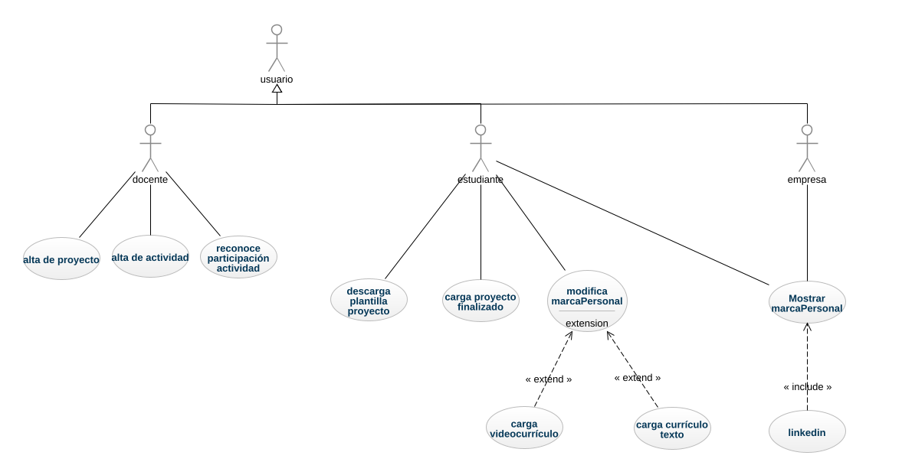
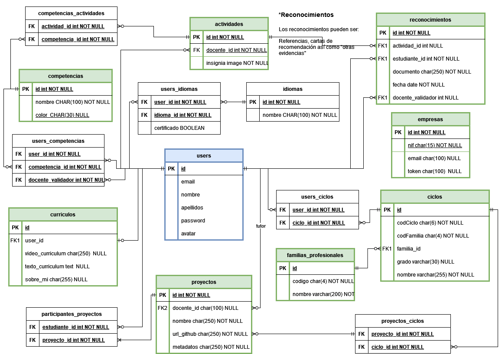

# REA marcapersonalFP.es

Este repositorio se ha creado para el desarrollo del REA multimodular [marcapersonalFP.es](https://marcapersonalfp.es).

Desarrollado en el [C.I.F.P. Carlos III](https://cifpcarlos3.es) por los docentes del ciclo formativo **Desarrollo de Aplicaciones Web**.

## Contenidos por Módulos

- [0612. Desarrollo web en entorno cliente](./documentos/)
- [0613. Desarrollo web en entorno servidor](./documentos/0613_Servidor/README.md)
- [0614. Despliegue de aplicaciones web](./documentos/)
- [0615. Diseño de interfaces web](./documentos/)

## Definición del proyecto

El objetivo de este proyecto es la creación de una página web [marcaPersonalFP.es](https://marcaPersonalFP.es) en la que los estudiantes de Formación Profesional puedan publicar su currículo y los logros conseguidos a lo largo de su estancia en el centro.

El diagrama de casos de uso inicial que se plantea es el que se puede ver en la siguiente imagen:

Por su parte, la base de datos que dará soporte a la web seguirá el siguiente esquema:

## Máquina Virtual

Para el desarrollo de la aplicación, se facilita una máquina virtual de VirtualBox con los siguientes componentes:

- Debian 11 - Openbox
- Docker
- PHP y Composer 2
- Visual Studio Code
- NodeJS
- Depuración con XDebug
- Laradock preinstalado en `/home/alumno/Documentos/laravel/laradock`

_Es recomendable instalar las Guest Additions_

Inicia sesión con las siguientes credenciales:

- **login:** alumno
- **password:** alumno
