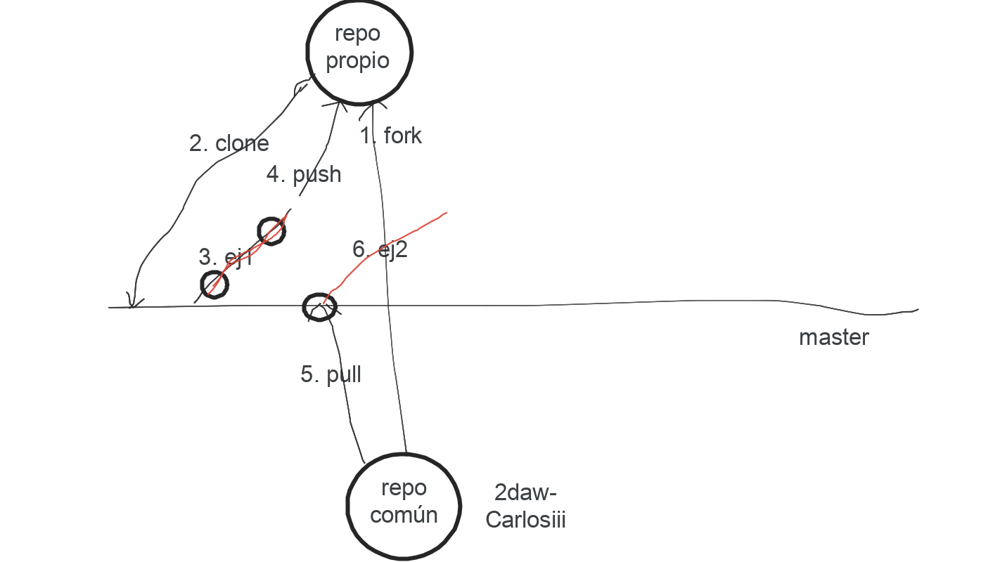

# Desarrollo colaborativo con GitHub

Para poder trabajar colaborativamente y tener actualizado el código con las aportaciones de otros colaboradores, uno de los miembros del equipo debe crear el repositorio base en su cuenta de GitHub, con el código inicial de la aplicación.

## Crear el repositorio en GitHub

1. En la esquina superior derecha de cualquier página, utiliza el menú desplegable y selecciona **New repository** (Nuevo repositorio).

    

2. Escriba un nombre corto y fácil de recordar para el repositorio. Por ejemplo: "marcapersonalfp".

    

3. Opcionalmente, se puede agregar una descripción del repositorio. Por ejemplo, "Aplicación MarcaPersonal FP".

4. Elegiremos repositorio público y no crearemos ni archivo `README.md` ni licencia.

5. Haga clic en **Create repository** (Crear repositorio).

Felicidades. Ha creado correctamente su primer repositorio.

## Código inicial del repositorio

Una vez que tenemos una aplicación iniciada de alguna de las formas descritas en la sección anterior, accederemos al directorio de la aplicación y, desde allí, iniciaremos un repositorio `git`. Para ello, ejecutaremos:

```
cd marcapersonalfp; git init; git add .; git commit -m "Initial commit"; cd ..
```

Colocaremos en repositorio de _GitHub_ el primer `commit` creado en nuestra aplicación:

```
git remote add origin https://github.com/[tu usuario]/marcapersonalfp.git
git push -u origin master
```

## Colaborando en el repositorio

Todos los miembros del equipo deberán acceder al repositorio base de _GitHub_ y pulsar sobre el botón `Fork`, que encontrarás a la derecha de la pantalla, para hacer un `fork` del repositorio base en tu cuenta de _GitHub_.

A continuación, se descargarán el código fuente al equipo personal. Para ello, copia el enlace que aparece al pulsar sobre el botón **<> Code**

Desde el directorio _Laravel_, deberás ejecutar el siguiente comando:

```
git clone https://github.com/[tu usuario]/marcapersonalfp.git
```

Mantendremos un enlace al repositorio original:

```
git remote add upstream https://github.com/albsierra/marcapersonalfp.git
```

A continuación, debemos descargar las librerías necesarias para cualquier proyecto _Laravel_, es decir, aquellas que se definen en el fichero `composer.json`. Para conseguirlo, necesitamos poder ejecutar un comando _php_, por lo que necesitaremos también estar en una consola de _bash_, levantando previamente los contenedores si no se han levantado previamente.

```
cd laradock
docker compose up -d nginx mariadb phpmyadmin workspace

cd ../marcapersonalfp
composer install
```

Cuando clonamos un repositorio, este nunca deberá incluir el fichero `.env`. Pero, este fichero es importante, ya que en él definiremos el entorno en el que se va a ejecutar nuestra aplicación. Para generar un archivo `.env`, haremos una copia del fichero `.env.example`.

Tras hacer la copia, debemos definir los elementos correspondientes a la cadena de conexión de la base de datos:

```
DB_CONNECTION=mysql
DB_HOST=mariadb
DB_PORT=3306
DB_DATABASE=marcapersonalfp
DB_USERNAME=marcapersonalfp
DB_PASSWORD=marcapersonalfp
```

También debemos crear una clave de encriptación, ejecutando el comando:

```
php artisan key:generate
```

## Preparando el servidor de bases de datos y web

### NGINX

- Ir a laradock/nginx/sites y duplicar laravel.conf.example a marcapersonalfp.conf.

- Modificar en el fichero marcapersonalfp.conf estas dos líneas:

    ```
    server_name marcapersonalfp.test;
    root /var/www/marcapersonalfp/public;
    ```

- Modifica el archivo hosts para que traduzca convenientemente la url marcapersonalfp.test.

    ```
    127.0.0.1  marcapersonalfp.test
    ```

- Reiniciamos el contenedor de NGINX

    ```
    docker compose restart nginx
    ```

### MariaDB

Accediendo a _phpMyAdmin_ crearemos un usuario `'marcapersonalfp'@'%'`, con contraseña `marcapersonalfp`. A la vez que se crea el usuario `marcapersonalfp`, se puede crear una base de datos con el mismo nombre y otorgarle a ese usuario todos los permisos en dicha base de datos.

```
CREATE USER 'marcapersonalfp'@'%' IDENTIFIED VIA mysql_native_password USING PASSWORD('marcapersonalfp');GRANT USAGE ON *.* TO 'marcapersonalfp'@'%' REQUIRE NONE WITH MAX_QUERIES_PER_HOUR 0 MAX_CONNECTIONS_PER_HOUR 0 MAX_UPDATES_PER_HOUR 0 MAX_USER_CONNECTIONS 0;CREATE DATABASE IF NOT EXISTS `marcapersonalfp`;GRANT ALL PRIVILEGES ON `marcapersonalfp`.* TO 'marcapersonalfp'@'%';GRANT ALL PRIVILEGES ON `marcapersonalfp\_%`.* TO 'marcapersonalfp'@'%';
```

## Desarrollo de la aplicación

A partir de este momento, todos los cambios en el código fuente, se deberán desarrollar en ramas.

Antes de iniciar cada funcionalidad de la aplicación deberás crear una rama _funcionalidadI_ y cambiarte a ella, con el comando:

```
git checkout -b funcionalidadI
```

A la finalización de cada funcionalidad, deberás:

- Añadir los cambios a un commit (desde el directorio marcapersonalfp)
    ```
    git add .
    git commit -m "Solución a los ejercicios _"
    git push origin ejerciciosI
    ```

- Acceder a tu repositorio de _GitHub_ y solicitar un _Pull Request_ de tu rama, para solicitar que sea integrada en el repositorio base.

- Uno de los miembros del equipo deberá aceptar el **Pull Request** haciendo el `Merge`.

- Se actualizarán los repositorios locales y remotos de todos los miembros del equipo.

    ```
    git checkout master
    git pull upstream master
    git push origin master
    ```

El proceso se esquematiza en las siguientes imágenes:



[© by Dale Scott](https://www.dalescott.net)
