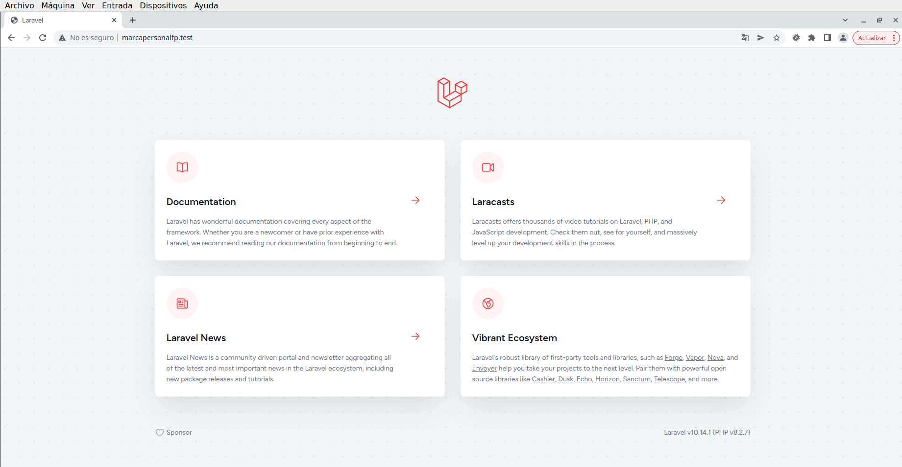

# 2.1 Instalación

Existen diferentes maneras de generar un proyecto Laravel. En las siguientes secciones veremos 2 de esas formas:
- [Utilizando Composer](#utilizando-composer)
- [Utilizando Laradock](#utilizando-laradock)

A lo largo del curso utilizaremos mayoritariamente la que hace uso de Laradock.

En cualquier caso, para almacenar los proyectos de Laravel que vayamos generando, crearemos un directorio `laravel` en el directorio `Documentos`.

```bash
cd ~/Documentos
mkdir laravel
cd laravel/
```

Y nos aseguraremos de tener actualizado Composer:

```bash
sudo composer self-update --2
```

## Utilizando Composer

Antes de poder utilizar Laravel, debemos asegurarnos de cumplir sus requisitos:

- PHP
- [Composer](https://getcomposer.org/)
- [Node y NPM](https://nodejs.org/)

A continuación, instalaremos Laravel installer utilizando composer, el cual ya tenemos instalado en la máquina virtual.

```bash
composer global require "laravel/installer"
```

Nos debemos asegurar de que el ejecutable de `laravel` sea accesible desde terminal de comandos. Para ello, editaremos el archivo `~/.bashrc` e incluiremos, al final del mismo, la siguiente línea:

```bash
alias laravel='~/.config/composer/vendor/bin/laravel'
```

Como ya hemos hecho en anteriores ocasiones, podemos cerrar el terminal y volver a abrirlo, para que tenga efecto la línea anterior o, simplemente, ejecutar el siguiente comando:

```bash
source ~/.bashrc
```

En este momento, ya podremos utilizar laravel para crear nuestra primera aplicación web:

```bash
laravel new prueba
```

La aplicación web creada con Laravel se encontrará en el directorio `prueba`.

```bash
cd prueba
```

En el entorno de desarrollo, podemos usar el servidor web que nos proporciona el propio Laravel a través de su _CLI_ `artisan`.

```bash
php artisan serve
```

El resultado lo podremos comprobar si accedemos a la dirección https://localhost:8000, a través de un navegador.

## Utilizando Laradock

### Estructura de carpetas

Una vez completados todos los pasos, la estructura quedará así:

```.
└── laravel
    ├── marcapersonalfp
    └── laradock
```


### Descargar Laradock
_Si estás utilizando la máquina virtual que se ofrece en esta documentación, puedes saltar a la sección [Nuevo proyecto de Laravel](#nuevo-proyecto-de-laravel) porque laradock ya está incluido._

1. Clonar el repositorio:

    ```bash
    git clone https://github.com/Laradock/laradock.git
    ```
    > Para que funcione, tiene que estar instalado el [cliente de línea de comandos de Git](https://git-scm.com/downloads).

2. Copiar el fichero `.env.example` a `.env`:

    ```bash
    cd laradock && cp .env.example .env && cd ..
    ```

3. Editar el fichero `.env` de la carpeta laradock:

    - Seleccionar la versión de PHP: `PHP_VERSION=8.2`
    - Modificar el driver de base de datos de phpMyAdmin: `PMA_DB_ENGINE=mariadb`

4. Habilitar la depuración de código:

    - Añadir _XDEBUG_ a WORKSPACE y PHP-FPM para poder depurar: `WORKSPACE_INSTALL_XDEBUG=true` y `PHP_FPM_INSTALL_XDEBUG=true`
    - Modificar también los puertos asociados a _XDEBUG_: `WORKSPACE_XDEBUG_PORT=9003` y `PHP_FPM_XDEBUG_PORT=9003`
    - Modificar los archivos `php-fpm/xdebug.ini` y `workspace/xdebug.ini` con el siguiente contenido:
        ```bash
        ; NOTE: The actual debug.so extention is NOT SET HERE but rather (/usr/local/etc/php/conf.d/docker-php-ext-xdebug.ini)

        xdebug.client_host="host.docker.internal"
        xdebug.discover_client_host=1
        xdebug.client_port=9003
        xdebug.idekey=vsc
        xdebug.mode=debug
        xdebug.start_with_request=trigger

        xdebug.cli_color=0
        xdebug.output_dir="~/xdebug/phpstorm/tmp/profiling"

        xdebug.var_display_max_children=-1
        xdebug.var_display_max_data=-1
        xdebug.var_display_max_depth=-1

        ```

5. Editar el fichero `mariadb/my.cnf` para asignarle únicamente _256M_ a la variable `innodb_log_file_size`, en lugar de las _4048M_ con las que está configurada inicialmente.

6. Editar el fichero `mariadb/Dockerfile` sustituyendo la línea `CMD ["mysqld"]` por `CMD ["mariadbd"]`.

### Generar el proyecto

- Accedemos a la carpeta en la que vayamos a almacenar nuestros proyectos Laravel. En nuestro caso:

    ```bash
    cd ~/Documentos/laravel/
    ```

- Generamos el proyecto _marcapersonalfp_ con el siguiente comando:

    ```bash
    docker run -it --rm --name php-cli \
        -v "$PWD:/usr/src/app" thecodingmachine/php:8.2-v4-slim-cli \
        composer create-project --prefer-dist laravel/laravel marcapersonalfp
    ```

    > **atención** _Si quisiéramos generar más aplicaciones Laravel, únicamente deberíamos cambiar el nombre del proyecto, que se encuentra al final de la orden, después de `laravel/laravel`._

### Arrancar los contenedores necesarios:

Desde el directorio de _Laradock_ ejecutaremos el siguiente comando para arrancar los contenedores:

```bash
docker compose up -d nginx mariadb php-fpm phpmyadmin workspace
```

La primera vez que se ejecute este comando tardará bastante puesto que tiene que descargar muchas imágenes desde internet.

### Crear la base de datos

1. Acceder a [phpMyAdmin](http://localhost:8081/)

    - Servidor _mariadb_ y usuario _root_/_root_.
    - Acceder a la pestaña _Cuentas de usuario_ y, una vez en esa pestaña, seleccionar la opción _Agregar cuenta de usuario_.
    - Las credenciales del nuevo usuario serán _marcapersonalfp_ tanto para el nombre de usuario como para la contraseña.
    - Antes de hacer click en el botón _Continuar_ seleccionar la casilla _Crear base de datos con el mismo nombre y otorgar todos los privilegios_.

    Alternativamente, podemos acceder a la pestaña de SQL de phpMyAdmin o al contenedor de MariaDB y ejecutar las siguientes sentencias:

    ```sql
    CREATE USER 'marcapersonalfp'@'%' IDENTIFIED VIA mysql_native_password USING PASSWORD('marcapersonalfp');
    GRANT USAGE ON *.* TO 'marcapersonalfp'@'%' REQUIRE NONE WITH MAX_QUERIES_PER_HOUR 0 MAX_CONNECTIONS_PER_HOUR 0 MAX_UPDATES_PER_HOUR 0 MAX_USER_CONNECTIONS 0;
    CREATE DATABASE IF NOT EXISTS `marcapersonalfp`;
    GRANT ALL PRIVILEGES ON `marcapersonalfp`.* TO 'marcapersonalfp'@'%';
    ```

    Para acceder al contenedor de MariaDB podemos ejecutar el comando `docker exec -ti laradock-mariadb-1 /bin/bash`. Una vez en el interior del contenedor (`root@________:/# `), podremos iniciar una sesión de MariaDB ejecutando `mariadb -p` respondiendo con _root_ como contraseña y ejecutar las sentencias anteriores.

2. Editar el `.env` de la aplicación

    ```php
    DB_CONNECTION=mysql
    DB_HOST=mariadb
    DB_PORT=3306
    DB_DATABASE=marcapersonalfp
    DB_USERNAME=marcapersonalfp
    DB_PASSWORD=marcapersonalfp
    ```

### Definir un servidor virtual en nginx

Para cada aplicación, generaremos un servidor virtual. En este caso, nuestro servidor responderá a la url http://marcapersonalfp.test. Para ello:

1. Accedemos al directorio `laradock/nginx/sites` y duplicaremos `laravel.conf.example` con el nombre de `marcapersonalfp.conf`.

2. Modificaremos, en el fichero `marcapersonalfp.conf`, estas dos líneas:

    - `server_name marcapersonalfp.test;`
    - `root /var/www/marcapersonalfp/public;`

3. Añadiremos el archivo `/etc/hosts` (con `sudo`) una línea para que traduzca convenientemente la url `marcapersonalfp.test`.

    ```bash
    127.0.0.1  marcapersonalfp.test
    ```

4. Reiniciaremos el contenedor de NGINX desde el directorio `laradock`

    ```bash
    docker compose restart nginx
    ```

### (Re)arrancar los contenedores

Los comandos de `docker compose` se lanzan desde la carpeta `laradock`.

La primera vez que arrancamos los contenedores tarda mucho tiempo, ya que _Docker_ debe descargar las imágenes que le son necesarias.

Y para reiniciar un contenedor concreto:

```bash
docker compose restart nginx
```

#### Acceder al sitio web

Página principal: [http://marcapersonalfp.test](http://marcapersonalfp.test)



> Los pasos anteriores se pueden repetir para cualquier otra aplicación, cambiando cada aparición de _marcapersonalfp_ por el nombre que le queramos asignar a la nueva aplicación.

