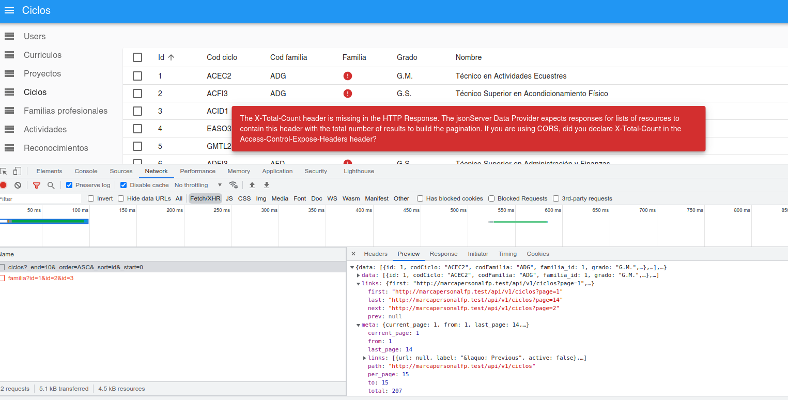

# Middleware para adaptarnos al cliente.

Si nos fijamos en la imagen, la API devuelve una respuesta completa, utilizando [HATEOAS](https://es.wikipedia.org/wiki/HATEOAS) (Hypermedia as the Engine of Application State).



También se puede observar que la respuesta no es del agrado del dataProvider utilizado por React-admin. Aunque en la imagen podemos ver uno de los problemas en la comunicación entre el backend y el frontend, vamos a tener que gestionar dos problemas diferentes:

1. **_React-admin_ espera que se le envíe, en la cabecera de la respuesta, el número total de registros que contiene la tabla (`X-Total-Count`)**.
2. **En lugar de obtener una respuesta completa _HATEOAS_, _React-admin_ es pera obtener directamente un _Array_ con los datos (sin _links_ ni _meta_)**

Como la API funciona correctamente, no debemos modificar el controlador para que, desde ahí, se modifique la respuesta. Hay que tener en cuenta que la petición `/api/v1/ciclos` es una de las muchas que nuestro _backend_ debe resolver. Por lo tanto, la misma corrección que hagamos para este _endpoint_ debería servir para todas las respuestas:

1. Podríamos modificar cada método `index()` de los controladores de aplicaciones con un código similar al siguiente:
    ```php
        /**
     * Display a listing of the resource.
     */
    public function index()
    {
        $response = CicloResource::collection(Ciclo::paginate())->response();
        $content = json_decode($response->content(), true);
        $response->setContent(json_encode($content['data']));
        $response->header('X-Total-Count', Ciclo::count());
        return $response;
    }
    ```
2. Crearemos un Middleware para capturar todas las respuestas y formatearlas para el frontend que estemos utilizando.

Claramente, **la opción que tiene mayores ventajas es la segunda**, que es la que desarrollaremos aquí.

## Objetivos del Middleware.

Cuando vimos los fundamentos de Laravel, nos iniciamos en el concepto de [Middleware](./032_middlewares.md), aunque no pudimos realizar ningún ejercicio útil.

En este momento, vamos a utilizar el Middleware para capturar la respuesta, antes de ser enviada al cliente, y formatearla según las exigencias de éste.

Por lo tanto, será un Middleware que se ejecutará [después de la petición](./032_middlewares.md#middleware-antes-o-después-de-la-petición).

## Creación del Middleware.

Para crear nuestro Middleware podemos utilizar el comando de Artisan:

```bash
php artisan make:middleware ReactAdminResponse
```

Este comando creará el fichero `ReactAdminResponse.php` dentro de la carpeta `app/Http/Middleware` con el siguiente contenido por defecto:

```php
<?php

namespace App\Http\Middleware;

use Closure;
use Illuminate\Http\Request;
use Symfony\Component\HttpFoundation\Response;

class ReactAdminResponse
{
    /**
     * Handle an incoming request.
     *
     * @param  \Closure(\Illuminate\Http\Request): (\Symfony\Component\HttpFoundation\Response)  $next
     */
    public function handle(Request $request, Closure $next): Response
    {
        return $next($request);
    }
}

```

Para capturar la respuesta, modificaremos la línea

```php
        return $next($request);
```

por

```php
        $response = $next($request);
```

A partir de esa línea, ya podremos desarrollar código que modifique la respuesta (`$response`) que se va a enviar al cliente. Lo haremos con el siguiente código:

```php
        $response = $next($request);
        if($request->routeIs('*.index')) {
            abort_unless(property_exists($request->route()->controller, 'modelclass'), 500, "It must exists a modelclass property in the controller.");
            $modelClassName = $request->route()->controller->modelclass;
            $response->header('X-Total-Count',$modelClassName::count());
        }
        try {
            if(is_callable([$response, 'getData'])) {
                $responseData = $response->getData();
                if(isset($responseData->data)) {
                    $response->setData($responseData->data);
                }
            }
        } catch (\Throwable $th) { }
        return $response;
```

El primer condicional lo utilizaremos para añadir la cabecera `X-Total-Count`, mientras que el segundo lo utilizamos para devolver únicamente el miembro `data` del objeto `$response`.

> Esto último lo podíamos haber hecho también en el cliente, modificando el archivo `resources/js/react-admin/dataProvider.ts` con el siguiente contenido

```php
import jsonServerProvider from 'ra-data-json-server';

const dataProvider = jsonServerProvider(import.meta.env.VITE_JSON_SERVER_URL);

export const myDataProvider = {
    ...dataProvider,
    getList: (resource, params) => {
        return dataProvider.getList(resource, params).then(response => {
        return {
            ...response,
            data: response.data.data,
        };
        });
    },
};
```

## Propiedad $modelclass

La utilización de este _Middleware_ va a requerir la creación de una propiedad `$modelclass` en cada uno de los controladores que tenga asociada la clase del modelo que tenga asociado el controlador

```php

    public $modelclass = Ciclo::class;
```

## Registro del Middleware

Para que este middleware sea utilizado en las respuestas, debemos elegir para qué tipo de peticiones se debe utilizar. Este registro lo debemos hacer en el elemento `api` de la propiedad `middlewareGroups` del fichero `app/Http/Kernel.php`, indicando con ello, que el middleware se utilizará para las peticiones dirigidas a la _API_:

```php
    protected $middlewareGroups = [
        'web' => [
            \App\Http\Middleware\EncryptCookies::class,
            \Illuminate\Cookie\Middleware\AddQueuedCookiesToResponse::class,
            \Illuminate\Session\Middleware\StartSession::class,
            \Illuminate\View\Middleware\ShareErrorsFromSession::class,
            \App\Http\Middleware\VerifyCsrfToken::class,
            \Illuminate\Routing\Middleware\SubstituteBindings::class,
            \App\Http\Middleware\HandleInertiaRequests::class,
            \Illuminate\Http\Middleware\AddLinkHeadersForPreloadedAssets::class,
        ],

        'api' => [
            // \Laravel\Sanctum\Http\Middleware\EnsureFrontendRequestsAreStateful::class,
            \Illuminate\Routing\Middleware\ThrottleRequests::class.':api',
            \Illuminate\Routing\Middleware\SubstituteBindings::class,
            \App\Http\Middleware\ReactAdminResponse::class,
        ],
    ];
```

## Ventajas de la utilización del Middleware

Las ventajas de haber modificado la respuesta con un _middleware_ en lugar de haberlo hecho directamente en el controlador son:

- Cuando desarrollamos el código del controlador no debemos estar pendiente del formato de la respuesta.
- **Si cambiamos o añadimos otros clientes con otros requisitos en las respuestas únicamente necesitaremos desarrollar otro middleware que cumpla esos requisitos**.

## Extensión al resto de los parámetros de React-admin

Podemos extender nuestra solución al resto de parámetros de React-admin, modificando:

- El código a ejecutar antes de `$response = $next($request);` en el middleware `/app/Http/Middleware/ReactAdminResponse.php`
    ```php
        $request->merge(['perPage' => 10]);
        if($request->filled('_start')) {
            if($request->filled('_end')) {
                $request->merge(['perPage' => $request->_end - $request->_start]);
            }
            $request->merge(['page' => $request->_start / $request->perPage + 1]);
        }
    ```
- El método `index` de `app/Http/Controllers/API/CicloController.php`
    ```php
    public function index(Request $request)
    {
        return CicloResource::collection(
            Ciclo::orderBy($request->_sort ?? 'id', $request->_order ?? 'asc')
            ->paginate($request->perPage));
    }
    ```